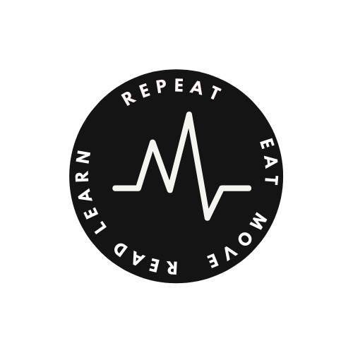

<p align="center">
  <a href="https://getbootstrap.com/">
    
  </a>
</p>

<h3 align="center">Jumiverse</h3>

<p align="center">
  Our Universe for writig posts.
  <br>
  <a href="[https://getbootstrap.com/docs/5.2/](https://mariaseltmann.github.io/)"><strong>Explore the umiverse docs »</strong></a>
  <br>
  <br>
  <a href="https://blog.umiverse.com/">Blog</a>
</p>


## Jumiverse 
Welcome to the Jumiverse


## Table of contents

- [Quick start](#quick-start)
- [Status](#status)


## Quick start

Several quick start options are available


## What's included

Within the download you'll find the following directories and files, logically grouping common assets and providing both compiled and minified variations.

<details>
  <summary>Download contents</summary>

  ```text

</details>


## Contributing

Please read through our [contributing guidelines](https://github.com/twbs/bootstrap/blob/main/.github/CONTRIBUTING.md). Included are directions for opening issues, coding standards, and notes on development.


## Creators

**Maria Seltmann**

**Jergen Ganzenmueller**
